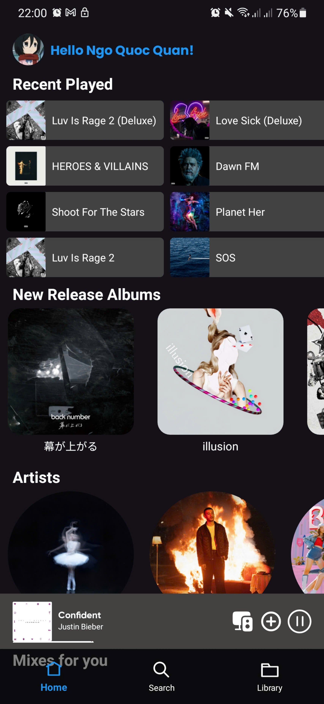
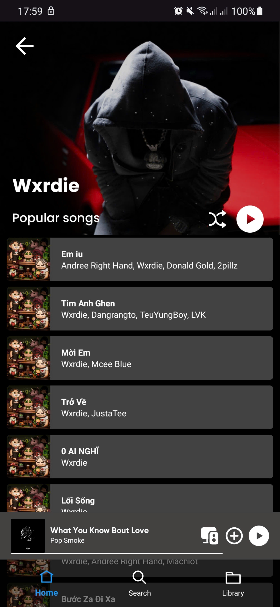
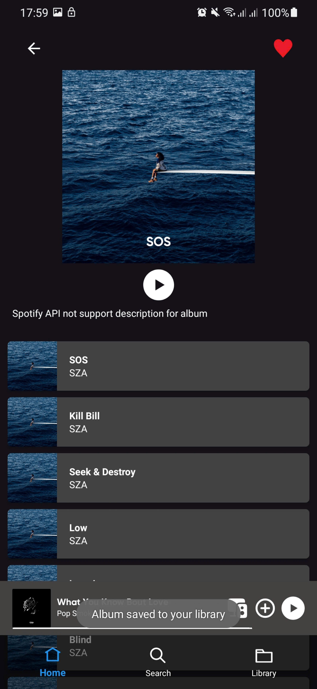
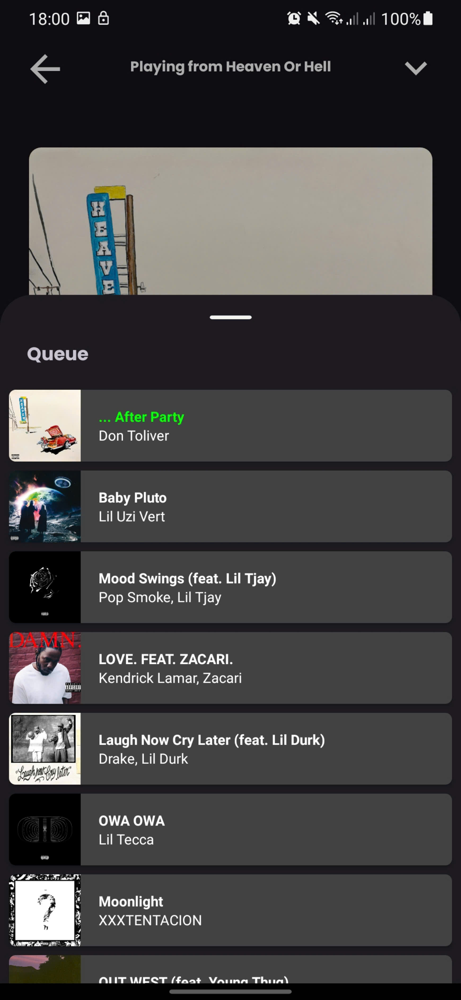
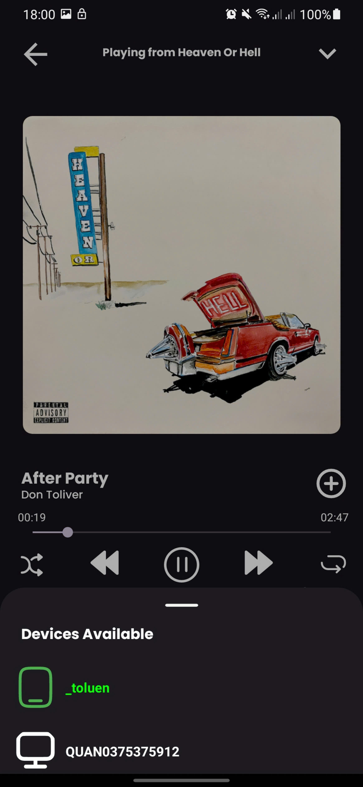
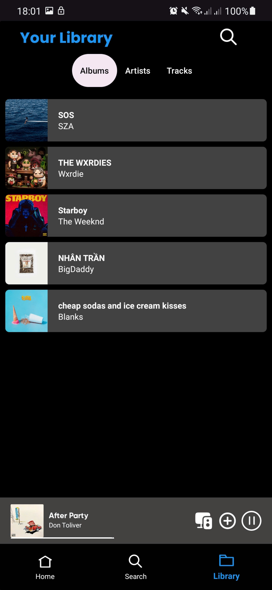
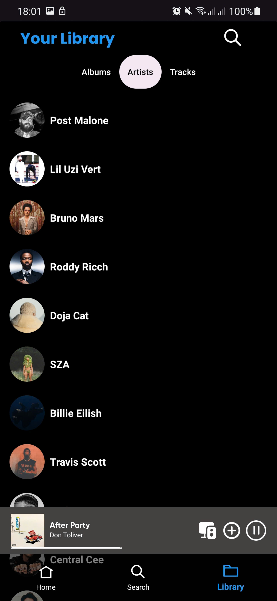

# 🎵 Spoti5

Spoti5 là một ứng dụng Android được phát triển bằng Kotlin, mô phỏng lại một phần chức năng của Spotify.  
Ứng dụng sử dụng [Spotify Web API](https://developer.spotify.com/documentation/web-api/) và [Spotify Android SDK](https://developer.spotify.com/documentation/android/) để lấy dữ liệu, điều khiển phát nhạc, và hiển thị thông tin bài hát.

Các endpoint được sử dụng nằm trong phần [Web API Reference](https://developer.spotify.com/documentation/web-api/reference/#).

---

## :star: Tính năng

- [x] Đăng nhập bằng tài khoản Spotify (Authorization Code Flow)
- [x] Lấy thông tin nhạc mới phát hành (New Releases)
- [x] Tìm kiếm bài hát, album, nghệ sĩ
- [x] Xem chi tiết album và danh sách bài hát
- [x] Xem User Queue và chọn để phát nhạc
- [x] Quản lý thiết bị và chuyển playback giữa các thiết bị 
- [x] Điều khiển phát nhạc bằng Spotify Android SDK (play, pause, next, previous)
- [x] Hiển thị danh sách bài hát đã nghe gần đây
- [x] Áp dụng kiến trúc **MVVM + Clean Architecture**
- [ ] Cache data
- [ ] Recustomize UI

---

# 🛠 Stack công nghệ

Ứng dụng được phát triển bằng Kotlin và sử dụng các thành phần sau:

- **MVVM + Clean Architecture**
- **Spotify Android SDK**
- **Retrofit** (gọi API)
- **OkHttp** (HTTP client + logging)
- **Gson** (parse JSON)
- **Coroutines** (xử lý bất đồng bộ)
- **ViewModel**
- **ViewBinding**
- **Navigation Component**
- **Hilt** (Dependency Injection)

---

## 📸 Screenshots

|  |  |  |
|-------------------------------------| ------------------- | --------------------- |
| **HomeScreen**                      | **Detail Artist**            | **Search**            |

|  |  |  |
| ---------------------------- | --------------------------- | -------------------- |
| **Album Details**            | **Track Playing**           | **User Queue**       |

|  |  |  |
| ---------------------------- | ---------------------------- | ----------------------- |
| **Devices Available**            | **Lib Album**           | **Lib Artists**    |

---

### 📱 Yêu cầu thiết bị
- >= Android 10 , min Android SKD 29
- Tài khoản Spotify

---

## :dart: Kiến trúc

Ứng dụng được xây dựng theo **Clean Architecture** dựa trên [Android Architecture Components](https://developer.android.com/jetpack/guide#recommended-app-arch).  
Chia thành 3 layer chính:

- **Domain**: Chứa business logic, model thuần và các use-case (optional, cho các chức năng yêu cầu logic nghiệp vụ khó).
- **Data**: Chứa API call, model dữ liệu, và repository implementation.
- **Presentation**: Chứa ViewModel và UI (Fragment/Activity).

Sơ đồ tổ chức:
```
   app/
    ├── data/
    │   ├── model/ 
    │   └── repositoryImpl/ 
    │
    ├── domain/
    │   ├── model/ 
    │   └── repository 
    │
    ├── presentation/
    │   └── ui/
    │       ├── fragments/
    │       └── adapters/
    │   └── viewmodels/
    │       ├── UiState
    │       └── ViewModel
    │
    └── di/ # Dependency Injection (Hilt Dagger)
```
